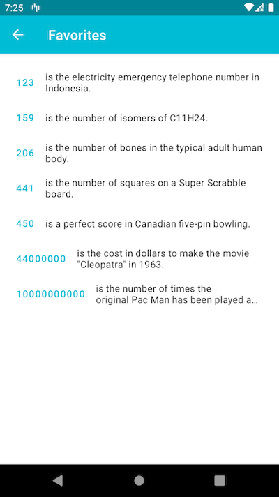

# juara-android

Juara-Android Indonesia 2022 [link](https://gdg.community.dev/events/details/google-gdg-jakarta-presents-info-session-juaraandroid-season-1/)  
**Google Developer Profile**: [natashaval](https://developers.google.com/profile/u/natashaval)  
Codelabs Training: [juara-android](https://github.com/natashaval/juara-android)  

## Project Demo
Number Trivia Project Demo  
  
Download the app here: [Google Drive](https://drive.google.com/drive/folders/1F95_fAqfvLtikyJLK8YpYs3XU_0x7oon?usp=sharing)
View the demo here: [Youtube](https://youtu.be/HploO0biq48)

## Overview
- Number Trivia is a simple Android application to show an interesting fact about numbers. The trivia is taken from NumbersApi.  

- On opening the app, it shows fun fact from a random number

- User fills out the input field and select the type
- User clicks on Generate button
- The app shows a fact for the requested number
- Clicking on the heart icon, the number is saved to Favorites
- Clicking again on the heart icon, the number is removed from Favorites

- User clicks on the numbers, and the app opens the number detail page
- Clicking the "Copy" button, the text is copied to device clipboard
- Clicking the "Send Trivia!" button, the text is opened in other app, such as Messages or Email

- The app shows a list of saved favorite numbers
- Clicking on one of the numbers, the number is opened in detail page

## Tech Stack
1. Android Navigation
2. ViewModel and LiveData
3. Retrofit
4. Room
5. Android Hilt dependency injection
6. Recycler View List Adapter
7. Implicit Intent

## Credits
Credits to [Numbers API](http://numbersapi.com/) for providing the API  
Made with ♥ natashaval️